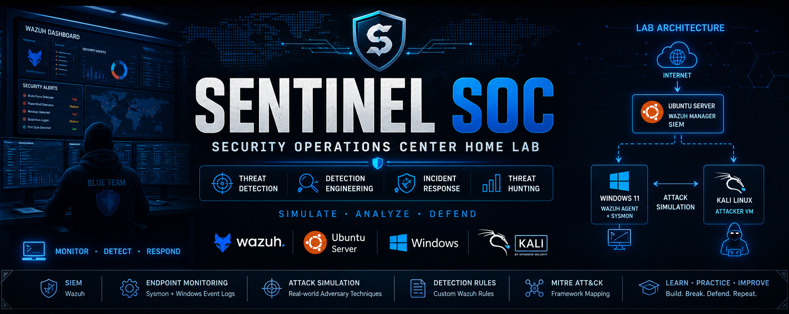

<p align="center">
  
</p>
# 🛡️ Sentinel SOC

> **An Open-Source Security Operations Center (SOC) Home Lab for Threat Detection, Incident Response, and Detection Engineering**


---
## 📑 Table of Contents

- [Overview](#-overview)
- [Project Objectives](#-project-objectives)
- [Lab Architecture](#-lab-architecture)
- [Technology Stack](#-technology-stack)
- [Features](#-features)
- [Attack Simulations](#-attack-simulations)
- [Detection Engineering](#-detection-engineering)
- [MITRE ATT&CK Coverage](#-mitre-attck-coverage)
- [Screenshots](#-screenshots)
- [Repository Structure](#-repository-structure)
- [Roadmap](#-roadmap)
- [Learning Outcomes](#-learning-outcomes)
- [License](#-license)
## 📖 Overview

Sentinel SOC is a hands-on Security Operations Center (SOC) home lab designed to simulate real-world cyber attacks, collect security telemetry, and detect malicious activities using **Wazuh SIEM**, **Sysmon**, and **Windows Event Logs**.

The project focuses on **Detection Engineering**, **Threat Hunting**, and **Incident Response**, helping cybersecurity learners gain practical Blue Team experience through realistic attack simulations.

---

## 🎯 Project Objectives

- Build a realistic SOC home lab
- Monitor Windows endpoints using Wazuh
- Collect enhanced telemetry using Sysmon
- Simulate attacker techniques from Kali Linux
- Create custom Wazuh detection rules
- Map detections to the MITRE ATT&CK Framework
- Develop practical SOC investigation skills

---

## 🏗️ Lab Architecture

> *(Architecture diagram will be added soon.)*

```text
                Internet
                    │
          Ubuntu Server (Wazuh Manager)
                    │
        ┌───────────┴───────────┐
        │                       │
 Windows 10 VM            Kali Linux VM
(Wazuh Agent + Sysmon)      (Attacker)
```

---

## 🛠️ Technology Stack

| Category | Technology |
|----------|------------|
| SIEM | Wazuh |
| Operating System | Ubuntu Server |
| Endpoint | Windows 10 |
| Monitoring | Sysmon |
| Attacker Machine | Kali Linux |
| Virtualization | VirtualBox |
| Framework | MITRE ATT&CK |

---

## 🔍 Features

- Windows Endpoint Monitoring
- Wazuh SIEM Integration
- Sysmon Log Collection
- Custom Detection Rules
- MITRE ATT&CK Mapping
- Attack Simulation
- Threat Detection
- Security Event Analysis
- Incident Investigation

---

## ⚔️ Attack Simulations

Current simulated attacks include:

- Windows Account Enumeration
- Network Reconnaissance
- Encoded PowerShell Execution
- Brute Force Detection
- Reverse Shell Detection
- Mimikatz Detection
- PsExec Detection

More attack simulations will be added as the project evolves.

---

## 🚨 Detection Engineering

Custom Wazuh rules are being developed to detect:

| Rule ID | Detection |
|---------|-----------|
| 100001 | Windows Account Enumeration |
| 100002 | Nmap Scan Detection |
| 100003 | Encoded PowerShell |
| 100004 | Multiple Failed Logons |
| 100005 | Reverse Shell |
| 100006 | Mimikatz Execution |
| 100007 | PsExec Execution |
| 100008 | Suspicious CMD Activity |

---

## 🎯 MITRE ATT&CK Coverage

Current techniques covered:

- T1033 – System Owner/User Discovery
- T1087 – Account Discovery
- T1046 – Network Service Discovery
- T1059.001 – PowerShell
- T1110 – Brute Force
- T1003 – Credential Dumping
- T1569.002 – Service Execution
- T1105 – Ingress Tool Transfer

---

## 📸 Screenshots

Screenshots will be added during development.

- Wazuh Dashboard
- Agent Registration
- Sysmon Configuration
- Alert Detection
- Custom Rule Alerts
- Attack Simulations

---

## 📂 Repository Structure

```text
Sentinel-SOC
│
├── docs/
├── Rules/
├── Screenshots/
├── Reports/
├── MITRE/
└── Resources/
```

---

## 🚀 Roadmap

- [x] Build SOC Lab
- [x] Configure Wazuh
- [x] Install Sysmon
- [x] Connect Windows Agent
- [x] Create Initial Detection Rules
- [ ] Expand Detection Rules
- [ ] Threat Hunting
- [ ] Sigma Rules
- [ ] Dashboard Improvements
- [ ] Digital Forensics Integration
- [ ] Final Documentation

---

## 📚 Learning Outcomes

This project demonstrates practical experience with:

- Security Operations Center (SOC)
- Detection Engineering
- Threat Hunting
- Incident Response
- Windows Event Logging
- Sysmon
- Wazuh SIEM
- MITRE ATT&CK
- Blue Team Operations

---

## 📜 License

This project is licensed under the MIT License.

---

⭐ If you found this project useful, consider giving it a star.
